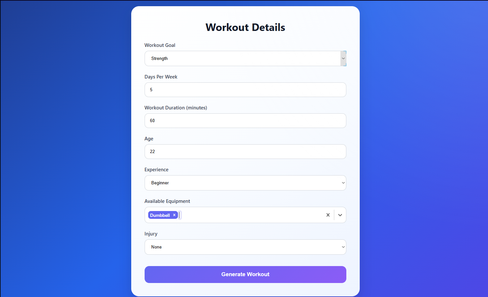
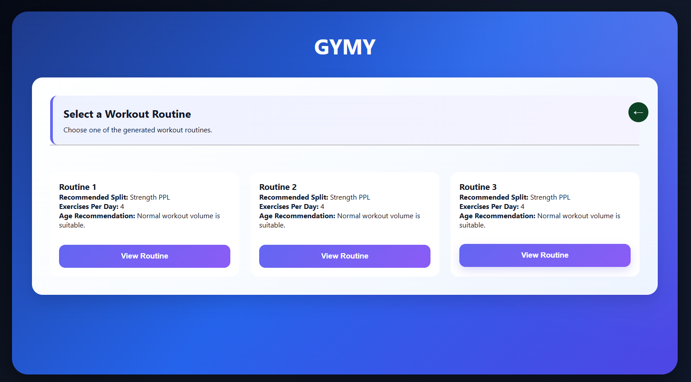
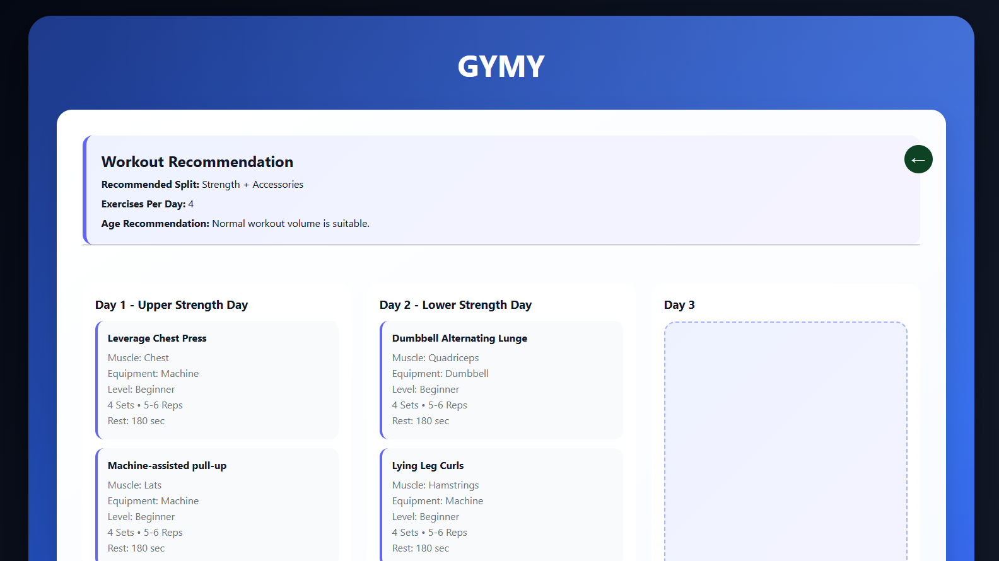
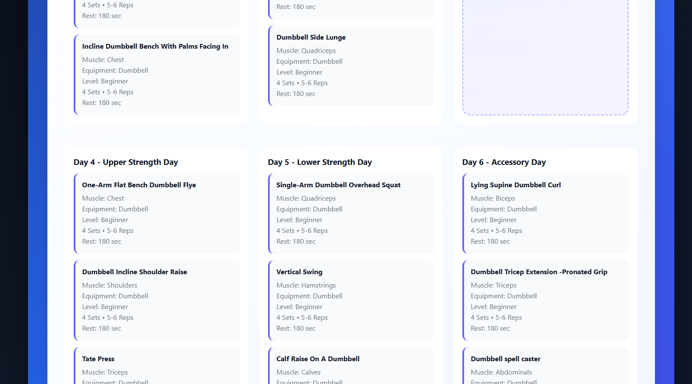

<p align="center">
  
</p>


---
# 📖 Project Overview

GYMY is a **Workout Routine Recommendation System** that generates personalized gym workout plans based on a user's profile and preferences.

Users provide information such as:

- Age
- Workout Duration
- Fitness Goal
- Experience Level
- Workout Days Per Week
- Available Equipment
- Injuries or Physical Limitations

Based on these inputs, the application recommends optimized workout routines using a recommendation engine backed by a MySQL database.

The project demonstrates the use of modern full-stack development technologies by combining a React frontend, FastAPI backend, MySQL database, and Docker containerization into a scalable recommendation system.

---
# 📑 Index


- [📚 Documentation](#-documentation)
- [✨ Features](#-features)
- [🛠 Technology Stack](#-technology-stack)
- [📂 Project Structure](#-project-structure)
- [⚙️ How To Install](#️-how-to-install)
- [🚀 How To Use](#-how-to-use)
- [🌐 Application URLs](#-application-urls)
- [⚙️ How the Recommendation Engine Works](#️-how-the-recommendation-engine-works)
- [🐳 Docker Architecture](#-docker-architecture)
- [📊 Dataset Source](#-dataset-source)
- [📸 Screenshots](#-screenshots)
- [🔮 Future Improvements](#-future-improvements)
- [👨‍💻 Author](#-author)
- [🙏 Acknowledgements](#-acknowledgements)
- [📖 Declaration](#-declaration)
---

# 📚 Documentation

Detailed documentation has been split into separate files for easier navigation.

- 🙏 [Motivation](docs/motivation.md)
- 🚀 [Installation Guide](docs/install.md)
- 📖 [Usage Guide](docs/usage.md)
- 🏗️ [Architecture](docs/architecture.md)
- 🔗 [API Documentation](docs/apidocument.md)
---

# ✨ Features

- Personalized workout recommendations
- FastAPI
- React frontend
- MySQL database
- Docker Compose support
- Responsive user interface
- Input validation using Pydantic
- Rule-based recommendation engine

---

# 🛠 Technology Stack

## Backend

- Python
- FastAPI
- SQLAlchemy
- Pydantic
- Uvicorn
- PyMySQL

## Frontend

- React
- Vite
- Axios
- CSS

## Database

- MySQL

## DevOps

- Docker
- Docker Compose

## Development Tools

- Visual Studio Code
- Git
- GitHub

---

# 📂 Project Structure

```text
GymRecom/
│
├── Backend/
│   ├── schemas.py
│   ├── engine.py
│   ├── Dockerfile
│   ├── requirements.txt
│   └── main.py
│
├── Frontend/
│   ├── src/
│   │     ├── assets/
│   │     ├── styles/
│   │     │        └── app.css
│   │     ├── services/
│   │     │        └── api.js
│   │     ├── components/
│   │     │        ├── F.jsx
│   │     │        ├── I.jsx
│   │     │        └── R.jsx
│   │     ├── App.jsx
│   │     └── main.jsx
│   ├── public/
│   ├── Dockerfile
│   ├── package.json
│   └── vite.config.js
├── docs/
│   ├── architecture.md
│   ├── install.md
│   ├── usage.md
│   └── apidocument.md
├── mysql-init/
│   └── cleaneddataset.sql
│
├── docker-compose.yml
│
└── README.md
```

---
# ⚙️ How To Install

Full setup instructions, prerequisites, and troubleshooting for getting the project running are in [Installation Guide](docs/install.md).

In short.

```bash
git clone https://github.com/AadarshAadi/GymRecom.git
cd GymRecom
docker compose up --build
```

Then open http://localhost:5173.

---
# 🚀 How To Use

A full walkthrough of the interface, what each field does, and a worked example of a recommendation request is in [How to Use](docs/usage.md).

In short, enter your preferences, select any of the generated routines and view the entire plan or browse other plans on will.

---
# 🌐 Application URLs

Frontend

```
http://localhost:5173
```

Backend API

```
http://localhost:8000
```
---
# ⚙️ How the Recommendation Engine Works

1. User submits workout preferences.
2. FastAPI validates incoming data.
3. Recommendation engine loads exercise data from MySQL.
4. Exercises are filtered according to:
   - Fitness Goal
   - Experience Level
   - Workout Duration
   - Workout Frequency
   - Equipment Availability
   - Injury Information
5. Matching exercises are grouped into a workout plan.
6. Results are returned as JSON.
7. React displays the workout routines.

---

# 🐳 Docker Architecture

The project consists of three independent containers.

### Frontend

- React
- Vite

### Backend

- FastAPI
- Recommendation Engine

### Database

- MySQL

Docker Compose automatically creates the network and allows communication between all containers.

---

# 📊 Dataset Source

Dataset used:

**Gym Exercise Dataset**

Author:
**Niharika Pandit**

Source:

https://www.kaggle.com/datasets/niharika41298/gym-exercise-data

The dataset was cleaned and transformed before being imported into MySQL.
Refer [Architecture](docs/architecture.md) for more info.
---

# 📸 Screenshots

### User Input Form



### Routine Selection



### Workout Recommendation






---

# 🔮 Future Improvements

- User authentication and Profile
- Workout history
- Progress tracking
- Nutrition recommendations
- Exercise videos
- Cloud deployment
- Mobile application
---

# 👨‍💻 Author

**Aadarsh**

GitHub:

https://github.com/AadarshAadi

---

# 🙏 Acknowledgements

Open-source technologies used:

- FastAPI
- React
- Docker
- MySQL
- SQLAlchemy
- Pydantic
- Vite
- Axios

Special thanks to the open-source community and Kaggle for providing the dataset used in this project.

---
# 📖 Declaration

For fully transparency, I have used ChatGPT to help speed up some of the repetitive tasks in this project:
- **MySQL bugs:** MySQL setup through docker was causing errors repeatedly, I used ChatGPT to solve those errors.
- **Syntax Generation:** Some complex syntax of workout filtering logic in the Engine.py were written by ChatGPT, the logic was given by me, the syntax code was taken and pasted in the engine.py. CSS styling and Frontend allignment were referred from ChatGPT.
- **Proofreading:** I also used ChatGPT to check grammar in this README and other technical docs and also be grammetically correct while writting DOCSTRINGS AND JSDOCS.

Aside from that, the rules of recommendation, the pre-processing techniques, the React frontend design and the Docker container logic were built by me.